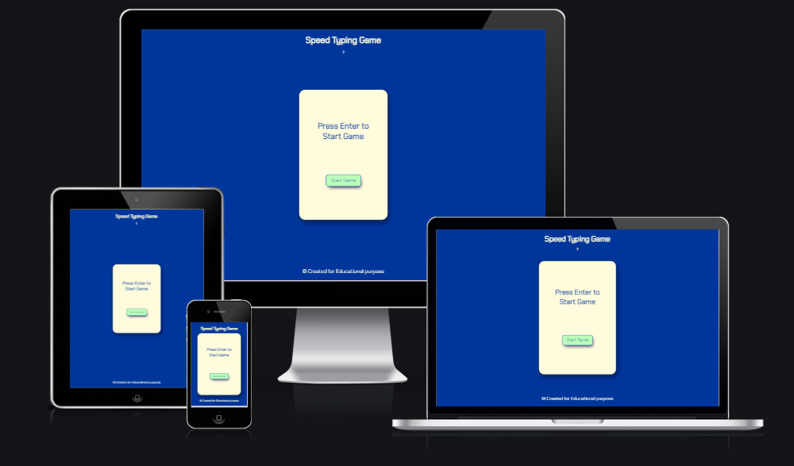

# [Speed Typing Game](https://bgmwebdev.github.io/SpeedTypingGame/ "Live Link")

## Introduction

Welcome to the Speed Typing Game. A game with educational purpose, for anyone who aims to become a faster typer, but also just for the fun of it. Type as many of the 6-letter words that are shown, as you can, in 60 seconds. There is a direct feedbackloop when the letters are typed, through colouring of the letters, either red or green. When you have finished you can get your score by email or try again immediately. But be careful, it's addictive! This game is written in HTML, CSS and JavaScript. 

## Table of Content

[Introduction](#introduction)

[Table of content](#table-of-content)

[Project Goals](#project-goals)
- [User Goals](#user-goals)
- [Site owner Goals](#site-owner-goals)

[User Experience](#user-experience)
- [Target audience](#target-audience)
- [User Requirements and Expectations](#user-requirements-and-expectations)
- [User Stories](#user-stories)
- [Site Owner Stories](#site-owner-stories)

[Features](#features)
- [Header](#header)
- [Start Game page](#start-game-page)
- [Footer](#footer)
- [Game Play page](#game-play-page)
- [End Game page](#end-game-page)
- [Send email](#send-email)
- [Email sent alert](#email-sent-alert)
- [Email recieved](#email-recieved)

[Wireframes](#wireframes)

[Design choices](#design-choices)

[Features for the future](#features-for-the-future)

[Languages used](#languages-used)

[Testing](#testing)
- [Responsive design](#responsive-design)
- [Validation testing](#validation-testing)
- [Bugs & errors](#bugs--errors)

[Deployment](#deployment)
- [Steps](#steps)
- [Live link](#live-link)

[Credits](#credits)
- [Content](#content)
- [Media](#media)
- [books](#books)

### Project Goals
- #### User Goals
    - Play to get faster at typing.
    - A fun challenge to get a better score each time.

- #### Site owner Goals
    - Create an interactive game that is challenging and fun.
    - Create a game that people would want to play more often.
    - Create a responsive website so people can play on different devices.

### User Experience
- #### Target audience
    - People who want to become faster at typing either on mobile or keyboard.
    - People who want to play a challenging game.
    - People who want to play a quick and fun game.

- #### User Requirements and Expectations
    - The game's playability should be intuitive.
    - The game's navigation should be accessible through keyboard and mouse use.
    - People should be able to receive an email.
    - People should be able to return to start and play again without refreshing the page or use of browser window.
    - The game should look good on different sizes.

- #### User Stories
    - I would like to be challenged in the game.
    - I would like to have feedback wether or not I type the word correctly.
    - I want to be able to start typing directly, without having to click on the box first.
    - I want to be able to have to scorre send to me.
    - I want to get feedback wether or not the score was send.
    - I want to be able to play again right after.

- #### Site Owner Stories
    - 

### Features:
- #### Header
    - In the header you see a clear title, which also declares directly what the game is about. 

    
    - Underneath the title is a collapsible question mark, which, when pressed, will show the rules.
    - The rules are straight forward and easy to understand.
    - At this point in development, the rules collapsible still needs to be closed by yourself.

    

- #### Start Game page
    - This is the first page you'll see when you land on the website.
    - It states a clear message: press enter to start game.
    - There is a button which can be pressed if it's not already on focus, for example after reading the rules.

    

- #### Footer
    - The footer is clean and simple. 
    - For this project it didn't need much more.

    

- #### Game Play page
    - The game play page indicates the time, counting down from 60 to 0.
    - The score is shown and counts live as you type the words correctly.
    - There is a box that shows the example word you have to type. This word changes automatically when the word is correctly typed.
    - The example word letters will turn red when typed wrong and green when typed right.
    - There is an answer box, where you type in the word. This box is automatically emptied when the word is correct and a new word is shown.

    

- #### End Game page
    - This page starts with a congratulatory message stating your score.
    - It also calls for action if you want the score to be send to you.
    - There is a name box and email box. which you have to fill out if you would like the score.
    - A send score button to receive the score.
    - There is also a return button to start a new game.

    

- #### Send email
    - You have to fill out the name and email boxes if you would like the score. They are required.

    

- #### Email sent alert
    - After submitting, there is an alert message. This let's you know the email has been sent.

    

- #### Email recieved
    - Check your inbox (or junk), you've recieved your score and a message!

    

### Wireframes
    - Wireframe of the gameplay for mobile 

    - Wireframe of the gameplay for desktop

### Design choices
For the design I choose to keep it minimalistic. A bright blue color with a broken white contrasting color. For the Font I picked 'Chakra Petch', which I feel go really well with the theme, speed typing. It has this 80/90's-game-vibe to it which takes me back to old sega racing games. The color green on the buttons asks for action. Green is go! which made it an obvious choice for me. I wanted to keep the game in the center of the page and not take more space, as the focus needs to be in the center, where the words will be presented. Also we read from left to right and top to bottom, I wanted to keep everything centered (including the question mark) so it would be easy to navigate with the eyes top to bottom, and not lead you astray.
 

### Features for the future
- For now, the rules collapsible needs to be closed manually. I would like to add the option to click anywhere, for example start game, and that it would close automatically. 
- I would like to add feedback through sound. For example, every 5th word you would hear something like "great", "well done", "you're on fire".
- It would be nice to have a certificate send to your email with an everage typing speed which you can use to show off you skills, on LinkedIn for example. 
- Also a difficulty level could be added, by taking out the colouring feedback loop. That way you wouldn't see mistakes turn up red or correct answers green.

### Languages used
For this educational project I used HTML, CSS and a main focus on Javascript. 

### Testing
- #### Responsive design
    - This website is tested for responsive design through the use of different size settings in chrome dev-tools and its device toolbar.
    - Responsivity is also tested on http://ami.responsivedesign.is/ (see image at the top of the page in the introduction and down here) and on https://www.responsinator.com/ where also different viewport sizes are presented.
    - The smallest functional size is 260x540px. With a smaller size, elements will start to overlap.

    

- #### Validation testing
    - W3C HTML Test:[W3C HTML Validator](https://validator.w3.org/nu/#textarea).
    - Ran the html file throughout the process (if there were changes).
    - Made all necessary corrections if they were stated.
    - Ran test again to verify all HTML passed.

    

    - W3C Jigsaw CSS Test:W3C HTML Validator.
    - Uploaded stylesheet daily.
    - Made all necessary changes.
    - Ran test again to verify all CSS passed.

    

    - jshint.com Test to validate my JavaScript:[jshint validator](https://jshint.com/)
    - I ran partials of the JavaScript code daily through jshint.
    - JavaScript Tutor to validate my JavaScript:[JavaScript Tutor](https://pythontutor.com/javascript.html#mode=edit)
    - I ran partials of the JavaScript code daily through JavaScript Tutor, to try things out and validate.

    - I also ran a color contrast checker.

    

    - Lighthouse is used to test the live website on desktop and mobile to check performance and accessibility.
        - Lighthouse test on desktop:

        

        - Lighthouse test on mobile:

        

- #### Bugs & errors
    - First time I ran the game through lighthouse I had an 85% on accessibility, due to the fact that I did not have labels in the form and with my word box. 
    - Mid-way through the project I couldn't select or fill in the form on the last page. I changed z-index's to classes of hide and show. 
    - Up untill the end I had a manifest error pertaining to my favicon. I took it out, it resolved the error, but doesn't show the favicon anymore.

### Deployment
- #### Steps
I've deployed the website early on, so I could test and update the website constantly.
The steps taken to deploy the website are taken from the readme of my first project [Women's-circle](https://github.com/BGMwebdev/first-project/blob/main/README.md#testing).

1. In the GitHub repository, navigate to the Settings tab
2. Scroll down to Github pages in the left side menu
3. From the source section drop-down menu, select the main branch
4. Once the main branch has been selected, click "Save"
5. GitHub will display a message confirming that the site has been deployed successfully
6. GitHub will provide a link to the deployed site
7. Click on the link to view the site has deployed in a new tab

- #### Live link
The live link the deployed project can be found here: [Speed Typing Game](https://bgmwebdev.github.io/SpeedTypingGame/ "Live Link")

### Credits
- #### Content
    - looking back at the [Love Maths](https://github.com/BGMwebdev/love-maths) project helped me a lot to structure the projects JavaScript, to understand the interlacings of functions and event listeners and connect it with the right HTML elements.
    - [MDN](https://developer.mozilla.org/en-US/docs/Learn/JavaScript/Asynchronous/Promises) helped me to learn about promises and async functions.
    - [W3schools](https://www.w3schools.com/js/js_async.asp) also helped me to learn about async functions and how to use them.
    - How to create an array from the string of words I have in my game I learned from [W3schools](https://www.w3schools.com/jsref/jsref_split.asp).
    - How a timer works and is written I learned from [W3schools](https://www.w3schools.com/howto/howto_js_countdown.asp).
    - The countdown timer I used I copied from [freecodecamp](https://www.freecodecamp.org/news/how-to-create-a-countdown-timer/), I tweaked it to my own needs for this game.
    - [MDN](https://developer.mozilla.org/en-US/docs/Web/JavaScript/Reference/Functions/Arrow_functions) gave me a great overview of how to write and work with arrow functions. 
    - through the use of [Stack Overflow](https://stackoverflow.com/questions/11845678/adding-multiple-event-listeners-to-one-element) I found out how to use multiple event listeners with onen element. 
    - I took the example of a collapsible from [W3schools](https://www.w3schools.com/howto/howto_js_collapsible.asp) and tweaked to my own needs for this game. 
    - I used [emailjs.com](https://www.emailjs.com/docs/tutorial/overview/) and it's tutorial to set up the email service I used for my game. 
    - I found this cool [CSS Box Shadow Generator](https://html-css-js.com/css/generator/box-shadow/) that I used to create a bit of depth on my pages. 
    - I had a lot of help from [Web Dev Simplified](https://www.youtube.com/watch?v=R-7eQIHRszQ) and his tutorial on how to build a speed typing game with JavaScript. He gave me some inside on how to use async functions. I used his code for the async function, as for the loop to create red and green colors and adjusted it to my game. This helped me a lot in the learning proces of how to compare index of different elements and set/change their class. 
    - The video of [Acadea.io](https://www.youtube.com/watch?v=yZ93TTdGxa8) about Building a speed typing game inspired me to use the string of words the I have used them now. This was also one of the first video's on speed typing games I watched, which inspired me to try to build one myself.
    

- #### Media
    - I took all 6 letter words from [The free Dictionary](https://www.thefreedictionary.com/6-letter-words.htm)
    - I used an Icon from [Font Awesome](https://fontawesome.com/icons/keyboard?s=light) and generated a favicon from it through [Favicon Generator](https://favicon.io/favicon-converter/)
    

- #### books
    - [JavaScript & JQuery - Jon Duckett](https://www.amazon.ca/JavaScript-JQuery-Interactive-Front-End-Development/dp/1118531647)
    
